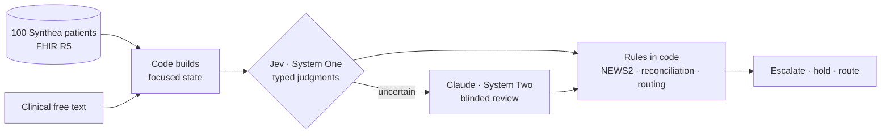

# Jev in the hospital: a System One evaluation

This repo tests [TypeSafe](https://docs.typesafe.ai)'s **System One** model, **Jev**, on three hospital decisions. It uses 100 synthetic FHIR patients, and Claude models act as author and escalation reviewer. Jev doesn't generate text: it returns **typed answers with calibrated probabilities** (Choice, Score and Noul) that code can branch on. The design question throughout is *which part of a clinical decision is a fast semantic judgment, and which part belongs in code or in a slower reasoning model?*

## Headline results

| Scenario | Primitives → task categories | Result |
| --- | --- | --- |
| [Ward deterioration](s1-ward.md) | Noul → detection · Score → scoring/ranking · Choice → classification | NEWS2 alone under-triaged **10/20** patients; NEWS2 + Jev under-triaged **1/20**. New-confusion Noul 20/20, including dementia at baseline vs new delirium. |
| [Discharge med reconciliation](s2-discharge.md) | Choice fan-out → structured extraction · Noul → verification · Score → scoring | **98%** of 143 medication statuses extracted correctly; allergy check 100% (including brand names). Duplicate/interaction checks are weak (multi-hop) and mostly escalate. |
| [Post-discharge inbox](s3-inbox.md) | Choice → routing · Score → urgency · Noul → detection | **7/20** messages auto-dispatched, all correctly; every misroute was caught by the confidence gate. Prompt injection did not steer routing. |
| [System Two review](system-two.md) | Confidence → escalation | 65 of 403 judgments (16%) escalated to a blinded Claude Sonnet 5 reviewer. |

**Cost and speed:** 403 typed judgments in 60 requests, **p50 329 ms** per request (4–15 questions each), **$0.0038** in total. See [models, timing & tokens](performance.md).

## What this shows about System One

- **Jev is strong at reading meaning.** It separated baseline from new confusion, caught negations, and read blanket statements, brand names and casual descriptions of emergencies.
- **Code stays in charge.** NEWS2, reconciliation and routing policy are deterministic and auditable. Jev supplies the inputs code can't compute. Changing a threshold or weight doesn't need a new prompt or a rerun.
- **Uncertainty is a usable signal, but not a complete one.** The gates caught every inbox misroute and most wrong discharge flags. Errors that got through were mostly Score answers one level off, often at confidence 0.4–0.6. So per-question thresholds need tuning on labelled local data before use.
- **The limits match the docs.** Questions that need several hops over a medication list (class duplication, interactions) are unreliable, and they should be decomposed further or escalated.

!!! warning "Not clinical validation"
    The patients, notes and messages are synthetic, and a Claude model wrote the reference labels, not clinicians. There are 20 cases per scenario, so every percentage here has wide uncertainty. This is a capability demonstration, not evidence of clinical safety.

Next: the [prompt and why these scenarios](prompt.md). New to the terms? See the [vocabulary](vocabulary.md).
