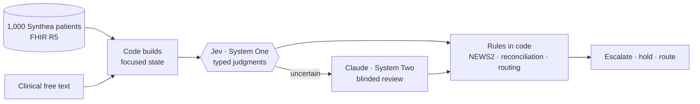

# Jev in the hospital: a System One evaluation

This repo tests [TypeSafe](https://docs.typesafe.ai)'s **System One** model, **Jev**, on five hospital tasks over **1,000 synthetic FHIR patients**. Claude models act as author, escalation reviewer and LLM baseline. Jev doesn't generate text: it returns **typed answers with calibrated probabilities** (Choice, Score and Noul) that code can branch on. The design question throughout is *which part of a clinical decision is a fast semantic judgment, and which part belongs in code or in a slower reasoning model?*

## Headline results

Scenarios 1–3 have 20 hand-written cases each (labels written by Claude), plus 80 [generated cases](generated.md) with labels known by construction. Generated results are from the held-out **test** split.

| Scenario | Primitives → task categories | Result |
| --- | --- | --- |
| [1. Ward deterioration](s1-ward.md) | Noul → detection · Score → scoring/ranking · Choice → classification | NEWS2 alone under-triaged **10/20** hand and **22/40** test patients; with Jev reading the note, **1/20** and **8/40**. |
| [2. Discharge med reconciliation](s2-discharge.md) | Choice fan-out → structured extraction · Noul → verification · Score → scoring | **98%** hand / **98%** test medication statuses extracted correctly; allergy check 100% on test. Whole-regimen interaction checks are weak; [decomposing them](generated.md#discharge-decomposing-the-weak-checks) helps but doesn't fix them. |
| [3. Post-discharge inbox](s3-inbox.md) | Choice → routing · Score → urgency · Noul → detection | The confidence gate auto-dispatched **7/20** hand and **16/40** test messages, **all correctly**; the rest went to review. None of the 5 prompt-injection messages was routed where the injection asked. |
| [4. Note search](s4-search.md) | Noul → search/retrieval · Choice → ranking | Lay questions over clinical notes: note recall **100%** vs 25% for keyword search; about 99% precision once treatment evidence the regex labels miss is counted. |
| [5. ML features](s5-features.md) | Score/Noul/Choice → feature extraction | Jev features from one note match structured data for predicting acute care (AUROC 0.64 vs 0.64); combined 0.65. Synthea caps what any feature can show. |
| [System Two review](system-two.md) | Confidence → escalation | 65 of 403 hand-case judgments (16%) escalated to a blinded Claude Sonnet 5 reviewer. |
| [LLM baseline](llm-baseline.md) | Same questions, Claude Haiku 4.5 | Accuracy is close, and neither model wins everywhere; Haiku costs **41–59×** more and is 5–8× slower. |
| [Independent labels](independent-labels.md) | Reference labels checked by another model family | A blind Codex pass differs from the Claude reference on **34/302** sampled judgments (κ 0.73 Noul, 0.94 Choice, 0.80 Score), mostly in discharge reconciliation; in 24 of them Jev gave the independent answer. |

**Cost and speed:** 24,557 typed Jev judgments in 4,722 requests, **p50 317 ms** per request (1 to 71 questions each), **$0.26** in total. See [models, timing & tokens](performance.md).

## What this shows about System One

- **Jev is strong at reading meaning.** It separated baseline from new confusion, caught negations, and read blanket statements, brand names, lay vocabulary and casual descriptions of emergencies.
- **Code stays in charge.** NEWS2, reconciliation and routing policy are deterministic and auditable. Jev supplies the inputs code can't compute. Changing a threshold or weight doesn't need a new prompt or a rerun.
- **Thresholds need local tuning.** Tuned on dev, `safeguarding` and `red_flag` want 0.85 and 0.75 rather than 0.5, and test accuracy rises accordingly. Uncertainty is a usable gate, but errors can still pass it, usually a Score one level off.
- **The limits match the docs.** Questions that need several hops over a medication list (class duplication, interactions) are unreliable. Decomposing them into narrow questions helps, but each sub-question can then fail on its own.
- **It's cheap enough to ask everything.** At a fraction of a cent per request, fanning out every plausible question (per medication, per note, per drug pair) is practical. The architecture question becomes what to do with the answers.

!!! warning "Not clinical validation"
    The patients, notes and messages are synthetic. The hand-case labels were written by a Claude model, not clinicians, and a [different model family](independent-labels.md) disagrees with some of them; nobody has adjudicated those yet ([issue #5](https://github.com/si618/explore-typesafe-ai/issues/5)). The generated labels are only as good as the snippets and tables they're built from. This is a capability demonstration, not evidence of clinical safety.

Next: the [prompt and why these scenarios](prompt.md). New to the terms? See the [vocabulary](vocabulary.md).
