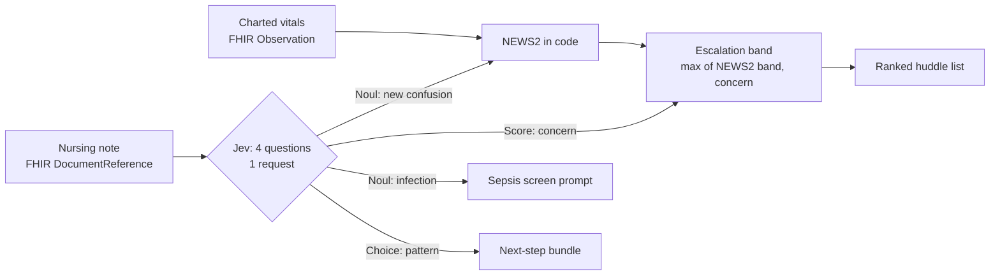

# 1. Ward deterioration huddle

Acute medical ward, 20 inpatients, evening safety huddle. Charted observations plus the nurse's latest progress note.

**Question:** can Jev read the nursing note for the signals that NEWS2 misses, while code keeps doing the arithmetic?



| Question | Primitive | Task category | How the answer is used |
| --- | --- | --- | --- |
| New change in mental state vs baseline? | Noul | Detection | If the chart says *Alert*, a yes becomes *Confusion* (3 NEWS2 points) |
| Infection signs or suspicion? | Noul | Detection | With NEWS2 ≥ 5, prompts a sepsis screen |
| How worried should the team be? | Score (4 levels) | Scoring → Ranking | Floor on the escalation band; weight in the priority sort |
| Main type of deterioration? | Choice (9 options) | Classification | Selects the next-step bundle (sepsis, ECG/troponin, CT head…) |

??? example "Exact questions sent to Jev"

    ```json
    {
      "new_confusion": {
        "type": "noul",
        "instructions": "Does `nursing_note` describe a new change in the patient's mental state or level of consciousness compared with their usual baseline, such as new confusion, disorientation, agitation, hallucinations, drowsiness or reduced responsiveness?",
        "criteria": {
          "true": "A change from the patient's usual mental state is described, even if they have dementia or a learning disability at baseline.",
          "false": "Mental state is normal, or unchanged from a known baseline such as long-standing dementia that is as usual."
        }
      },
      "infection": {
        "type": "noul",
        "instructions": "Does `nursing_note` describe signs of a current infection, an infection being treated, or a suspicion of infection?",
        "criteria": {
          "true": "For example fever, rigors, purulent sputum, urinary symptoms, spreading redness, or an infection under treatment.",
          "false": "No infection signs are described, or infection is explicitly ruled out."
        }
      },
      "concern": {
        "type": "score",
        "instructions": "How worried should the ward team be about this patient right now, based on `nursing_note`?",
        "criteria": [
          "Stable or improving, no new problems; routine care",
          "A minor issue to keep monitoring, with no clinical review needed today",
          "A worrying change that needs a doctor to assess within the hour, such as a behaviour change, an event that has since resolved, or family saying the patient is not themselves",
          "Acute deterioration happening now that needs immediate senior review or the rapid response team"
        ]
      },
      "pattern": {
        "type": "choice",
        "instructions": "What is the main type of clinical deterioration described in `nursing_note`?",
        "criteria": {
          "sepsis_infection": "Infection causing systemic illness: fever or rigors with fast heart rate, low blood pressure, new confusion or low urine output",
          "respiratory": "Worsening breathing, rising oxygen requirement or low oxygen saturation",
          "cardiac": "Chest pain, arrhythmia, or collapse from a heart cause",
          "neurological": "Stroke, head injury, seizure, delirium, or reduced consciousness from a brain cause",
          "bleeding": "Blood loss, such as black stools, vomiting blood, or bleeding with falling blood pressure",
          "metabolic_renal": "Blood sugar, electrolyte, calcium, fluid balance or kidney problems",
          "drug_or_substance": "Medication toxicity, over-sedation, or alcohol or drug withdrawal",
          "other": "A concerning change that fits none of the other options",
          "no_acute_change": "No deterioration: stable, improving, or at baseline"
        }
      }
    }
    ```

## Results

**20 requests, 80 questions** (4 per request) · latency p50 **334 ms**, p95 588 ms · 21,924 input / 3,113 output tokens · $0.0009

| Question | Primitive | n | Result vs reference |
| --- | --- | --- | --- |
| `new_confusion` | Noul | 20 | accuracy 100% (unambiguous 100%), Brier 0.009 |
| `infection` | Noul | 20 | accuracy 90% (unambiguous 100%), Brier 0.002 |
| `concern` | Score | 20 | exact level 85%, MAE 0.18 |
| `pattern` | Choice | 20 | accuracy 95% (primary label 85%) |

### Does Jev add anything to NEWS2?

| Policy | Band matches reference | Under-triaged | Over-triaged |
| --- | --- | --- | --- |
| NEWS2 from charted obs only | 50% | **10** / 20 | 0 |
| NEWS2 + Jev (confusion → ACVPU, concern floor) | 95% | **1** / 20 | 0 |

NEWS2 alone under-triaged 10 patients. All of them had the key signal only in the note: ongoing ischaemic chest pain, melaena with a NEWS2 of 4, alcohol withdrawal with hallucinations, an anticoagulated fall patient becoming unrousable, undocumented delirium, a daughter saying "she's not herself", a non-verbal patient's carer reporting a change, a transient bradycardic syncope, a GCS drop from 15 to 14 on head-injury obs, and blood sugars of 14–18 in a diabetic foot infection. The ranking puts 7 of the 8 reference emergencies in the top 8.

Literal-reading check: for the patient with long-standing Alzheimer's who is *"pleasantly confused… no change from his baseline"*, Jev returned new-confusion = **0.03**. For the patient with Alzheimer's plus new delirium, it returned **0.97**. The negation-heavy note ("No chest pain. No shortness of breath. No confusion…") returned **0.04**.

??? note "Ranked huddle list (all 20 patients)"

    | Admission | NEWS2 charted | Jev confusion | NEWS2 + Jev | Jev concern | Jev pattern | NEWS2-only band | Final band | Reference |
    | --- | --- | --- | --- | --- | --- | --- | --- | --- |
    | Community-acquired pneumonia | 10 | 0.91 | 13 | 2.96 | `respiratory` | emergency | **emergency** | emergency |
    | Pyelonephritis, day 2 | 8 | 0.94 | 11 | 2.91 | `sepsis_infection` | emergency | **emergency** | emergency |
    | Acute kidney injury on CKD stage 3 | 8 | 0.90 | 8 | 3.00 | `drug_or_substance` | emergency | **emergency** | emergency |
    | NSTEMI, day 2 | 4 | 0.91 | 7 | 2.44 | `drug_or_substance` | ward_review | **emergency** | emergency |
    | Chest infection; on warfarin for AF | 4 | 0.06 | 4 | 2.85 | `bleeding` | ward_review | **emergency** | emergency |
    | Unwitnessed fall at home, on warfarin for AF | 3 | 0.98 | 3 | 2.99 | `neurological` | urgent_review | **emergency** | emergency |
    | NSTEMI, awaiting angiography | 3 | 0.04 | 3 | 2.72 | `cardiac` | ward_review | **emergency** | emergency |
    | Fractured neck of femur, post-op day 2 hemiarthroplasty | 2 | 0.97 | 5 | 2.24 | `neurological` | ward_review | **urgent_review** | urgent_review |
    | Hypercalcaemia secondary to multiple myeloma, on IV fluids | 2 | 0.88 | 5 | 2.03 | `other` | ward_review | **urgent_review** | urgent_review |
    | Fall at home, no injury, awaiting OT assessment | 1 | 0.79 | 4 | 2.00 | `neurological` | ward_review | **urgent_review** | urgent_review |
    | Fall with head strike, head injury observations | 0 | 0.92 | 3 | 2.46 | `neurological` | routine | **urgent_review** ⬇ | emergency |
    | Infective exacerbation of COPD, day 4 of antibiotics | 5 | 0.03 | 5 | 0.01 | `no_acute_change` | urgent_review | **urgent_review** | urgent_review |
    | Syncope under investigation, on telemetry | 0 | 0.33 | 0 | 2.00 | `cardiac` | routine | **urgent_review** | urgent_review |
    | Acute asthma, day 2 | 2 | 0.03 | 2 | 0.35 | `no_acute_change` | ward_review | **ward_review** | ward_review |
    | Diabetic foot cellulitis, on IV antibiotics | 0 | 0.03 | 0 | 0.79 | `no_acute_change` | routine | **ward_review** | ward_review |
    | Right total knee replacement, post-op day 1 | 1 | 0.03 | 1 | 0.01 | `no_acute_change` | ward_review | **ward_review** | ward_review |
    | Community-acquired pneumonia, day 4 | 0 | 0.04 | 0 | 0.07 | `no_acute_change` | routine | **routine** | routine |
    | Elective admission for respite and medication review | 0 | 0.03 | 0 | 0.03 | `no_acute_change` | routine | **routine** | routine |
    | Inferior STEMI, day 3 post primary PCI | 0 | 0.03 | 0 | 0.01 | `no_acute_change` | routine | **routine** | routine |
    | Dehydration and AKI after gastroenteritis | 0 | 0.03 | 0 | 0.01 | `no_acute_change` | routine | **routine** | routine |

    ⬇ under-triaged vs reference · ⬆ over-triaged

The only band error is the head-injury patient: concern 2.46 rounded down to *urgent* when the reference is *emergency*. Rounding a fractional Score is a policy choice. Using `ceil` above x.4 for this question would have caught it, but I did not tune thresholds on this data.
