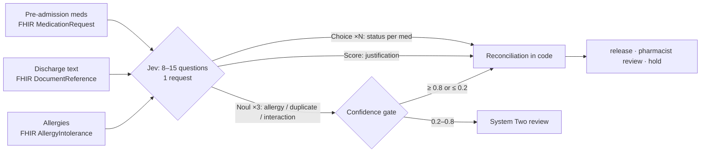

# 2. Discharge medication reconciliation

Pharmacy discharge check. Pre-admission medications come from the FHIR record; the discharge summary medication section is free text written by the discharging doctor.

**Question:** can one Jev request reconcile every pre-admission medication against a free-text plan, and verify the resulting regimen?



| Question | Primitive | Task category |
| --- | --- | --- |
| What happens to `pre_admission_medications[i]`? (one per med, fanned out) | Choice (5 options) | Structured data extraction |
| Prescribed drug in an allergy's drug class? | Noul | Verification |
| Same ingredient/class taken twice after discharge? | Noul | Verification |
| New drug with a clinically important interaction? | Noul | Verification |
| How well are the changes explained? | Score (4 levels) | Scoring |

??? example "Exact questions sent to Jev (one of the per-medication Choices shown)"

    ```json
    {
      "med_0": {
        "type": "choice",
        "instructions": "According to `discharge_medication_text`, what happens at discharge to the pre-admission medication `pre_admission_medications[0]` (Hydrochlorothiazide 25 MG Oral Tablet)?",
        "criteria": {
          "continued": "Continued at the same dose, either named explicitly or covered by a blanket statement such as 'continue all other medications'",
          "dose_changed": "Still taken, but the dose, frequency or directions change, for example increased, reduced, or changed to as-needed",
          "withheld": "Paused temporarily, with a plan to restart later",
          "stopped": "Stopped, discontinued, completed, or replaced by a different drug",
          "not_mentioned": "Not named and not covered by any blanket statement, so its status at discharge is unknown"
        }
      },
      "allergy_conflict": {
        "type": "noul",
        "instructions": "Does `discharge_medication_text` prescribe a medication that belongs to the same drug class as one of the patient's drug allergies listed in `patient.allergies`? Brand names and combination products count.",
        "criteria": {
          "true": "A prescribed or continued medication contains a drug from an allergy's drug class.",
          "false": "No prescribed medication belongs to an allergy's drug class. Food, environmental and animal allergies do not count."
        }
      },
      "duplicate_therapy": {
        "type": "noul",
        "instructions": "After discharge, will the patient be taking two or more medications with the same active ingredient or from the same therapeutic class for the same purpose, based on `pre_admission_medications` and `discharge_medication_text`?",
        "criteria": {
          "true": "Two or more concurrent medications share an active ingredient (including inside brand-name or combination products) or a therapeutic class.",
          "false": "Each active ingredient and therapeutic class appears once. Duplicates that the discharge text stops do not count."
        }
      },
      "interaction": {
        "type": "noul",
        "instructions": "Does a medication newly started in `discharge_medication_text` have a well-known, clinically important interaction with another medication the patient will be taking after discharge?",
        "criteria": {
          "true": "A new medication has a recognised interaction that prescribing guidance says to avoid or to manage actively.",
          "false": "New medications have no clinically important interaction with the rest of the regimen, or no medication is newly started."
        }
      },
      "justification": {
        "type": "score",
        "instructions": "How well does `discharge_medication_text` explain the medication changes it makes?",
        "criteria": [
          "Changes are made with no reasons given, or a blanket 'continue all' is used when the regimen clearly needed review",
          "New or changed medications are listed, but most have no reason or follow-up plan",
          "Most changes have a reason, but some reasons, durations or follow-up plans are missing",
          "Every change has a clear reason, with durations or follow-up plans where needed"
        ]
      }
    }
    ```

## Results

**20 requests, 223 questions** (8–15 per request) · latency p50 **324 ms**, p95 388 ms · 51,446 input / 9,808 output tokens · $0.0022

| Question | Primitive | n | Result vs reference |
| --- | --- | --- | --- |
| `med_status (per medication)` | Choice | 143 | accuracy 98% |
| `allergy_conflict` | Noul | 20 | accuracy 100% (unambiguous 100%), Brier 0.018 |
| `duplicate_therapy` | Noul | 20 | accuracy 70% (unambiguous 68%), Brier 0.202 |
| `interaction` | Noul | 20 | accuracy 75% (unambiguous 74%), Brier 0.171 |
| `justification` | Score | 20 | exact level 55%, MAE 0.46 |

**Extraction is the strong result.** Jev got 140 of 143 medication statuses right. That includes blanket statements ("continue all other medications"), brand names (Seretide, Norco, OxyContin) and Synthea's messy duplicate entries (simvastatin 10 mg *and* 20 mg). All 3 errors read an unchanged or unmentioned drug as *dose_changed*.

??? note "Per-medication confusion matrix (rows: reference, columns: Jev)"

    | reference \\ Jev | continued | dose_changed | withheld | stopped | not_mentioned |
    | --- | --- | --- | --- | --- | --- |
    | **continued** | 113 | 2 | · | · | · |
    | **dose_changed** | · | 4 | · | · | · |
    | **withheld** | · | · | 3 | · | · |
    | **stopped** | · | · | · | 17 | · |
    | **not_mentioned** | · | 1 | · | · | 3 |

    | Medication | Reference | Jev | Confidence |
    | --- | --- | --- | --- |
    | Simvastatin 10 MG Oral Tablet | not_mentioned | dose_changed | 0.84 |
    | Diazepam 5 MG Oral Tablet | continued | dose_changed | 0.95 |
    | Acetaminophen 300 MG / Hydrocodone Bitartrate 5 MG Oral Tablet | continued | dose_changed | 0.42 |

**The allergy check is perfect, including the hops.** *Augmentin* after *Tazocin* in a penicillin-allergic patient scored 0.93. Clarithromycin for a penicillin-allergic patient scored 0.25. Amoxicillin for a patient with *shellfish* and *mould* allergies scored 0.21.

**Duplicate and interaction checks are where Jev is weakest.** True positives score high (Norco + Tylenol 0.89; terfenadine + erythromycin 0.94). But negatives drift to 0.4–0.7 instead of near 0. Both questions need several hops: enumerate the regimen, map each drug to a class or interaction table, then compare pairs. This is the *indirection* failure mode in the [Jev 1.13 jaggedness notes](https://docs.typesafe.ai/model-jaggedness/jev-1.13). A naive 0.5 threshold therefore holds 8 discharges unnecessarily, with 0 missed holds. The confidence gate sends most of that grey zone to [System Two](system-two.md) instead of acting on it.

??? note "Per-discharge verification scores and action"

    | Admission | allergy | duplicate | interaction | justification | Action (0.5 threshold) | Reference action | Reference issues |
    | --- | --- | --- | --- | --- | --- | --- | --- |
    | Left lower leg cellulitis | 0.94 | 0.34 | 0.51 | 2.8 | hold | hold | allergy_conflict |
    | Pyelonephritis with acute kidney injury | 0.12 | 0.37 | 0.43 | 2.9 | release | release | – |
    | Delirium secondary to anticholinergic burden | 0.14 | 0.47 | 0.15 | 2.1 | release | pharmacist_review | – |
    | NSTEMI | 0.05 | 0.92 | 0.47 | 0.0 | hold | hold | duplicate_therapy |
    | NSTEMI treated with PCI | 0.05 | 0.65 | 0.45 | 2.7 | hold | release | – |
    | Acute asthma with lower respiratory tract infection | 0.25 | 0.63 | 0.79 | 1.3 | hold | release | – |
    | Anterior STEMI treated with PCI | 0.05 | 0.58 | 0.22 | 2.7 | hold | release | – |
    | Fall with distal radius fracture | 0.22 | 0.22 | 0.82 | 1.6 | hold | hold | interaction |
    | Lower respiratory tract infection | 0.05 | 0.39 | 0.91 | 1.6 | hold | hold | interaction |
    | Sepsis secondary to pneumonia | 0.21 | 0.44 | 0.34 | 2.3 | pharmacist_review | pharmacist_review | – |
    | Infective exacerbation of COPD | 0.93 | 0.52 | 0.41 | 1.3 | hold | hold | allergy_conflict |
    | Symptomatic hyponatraemia | 0.05 | 0.92 | 0.08 | 2.0 | hold | hold | duplicate_therapy |
    | Constipation and fall | 0.06 | 0.89 | 0.48 | 1.0 | hold | hold | duplicate_therapy |
    | Breakthrough seizure | 0.19 | 0.36 | 0.56 | 2.2 | hold | release | – |
    | Dyspepsia, normal endoscopy | 0.04 | 0.70 | 0.63 | 0.8 | hold | hold | duplicate_therapy, interaction |
    | Recurrent hypoglycaemia | 0.04 | 0.67 | 0.08 | 3.0 | hold | pharmacist_review | – |
    | Acute kidney injury | 0.05 | 0.71 | 0.09 | 2.9 | hold | release | – |
    | Facial cellulitis | 0.33 | 0.45 | 0.94 | 1.1 | hold | hold | interaction |
    | Inferior STEMI treated with PCI | 0.05 | 0.46 | 0.64 | 2.4 | hold | pharmacist_review | – |
    | Upper GI bleed from duodenal ulcer | 0.05 | 0.39 | 0.53 | 2.5 | hold | release | – |

**Decomposition, tested.** The [generated-cases page](generated.md#discharge-decomposing-the-weak-checks) runs v2 (a class Choice per medication, with duplicates counted in code, and pairwise interaction and allergy Nouls) and v2.1. On the generated test cases v2.1 cuts false holds from 4 to 1 with none missed. On these 20 hand cases it only goes from 8 to 6, because the pairwise interaction Nouls still over-call.
